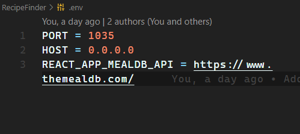
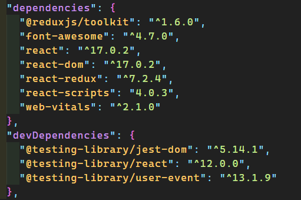
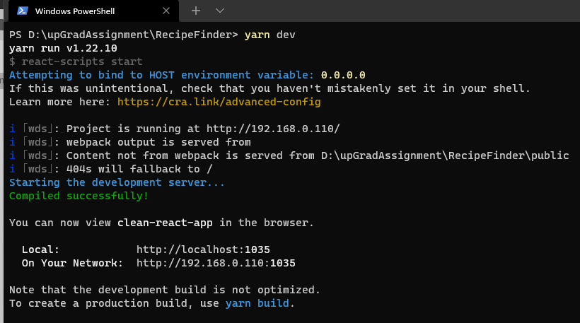

#

**Site Deployed on:** [https://heuristic-galileo-6b2b8f.netlify.app](https://heuristic-galileo-6b2b8f.netlify.app)

## TODOS

- [ ] The app is highly dependent on the [Meal DB API](https://www.themealdb.com/api.php) Create an `.env` file in the root of the folder (if does not exists) and specify the following key

| KEY                  | VALUE                      |
| -------------------- | -------------------------- |
| REACT_APP_MEALDB_API | https://www.themealdb.com/ |

## Build Steps

After you have cloned the repository, head out to the **RecipeFinder** folder and have a look at the `package.json` file in the root of that folder.

**Have a look at the dependencies, and the build scripts**

After you have looked into the supported scripts, you should have decided to serve a development version or a production version.

- `yarn run dev` to create a development server. NOTE: The port of the dev server is reflected in the **dev** server as in the `.env` file.
  
- `yarn build` to create a production version of the app. After this command is executed, find the static assets generated into the **build/** folder from which you can serve the static site.

---

## Problem Statement

**Goal**: You have to create a web page using React, which looks like the image below:

> Screenshot 1

> Screenshot 2

Project Screenshot

On this web page, you can enter the name of a dish that you want information on into a search input field. Once you find the required information, you can display it on the web page.

You’ll be using an API provided by TheMealDB. You can read more about the API at this link - [https://www.themealdb.com/](https://www.themealdb.com/)

## Guidelines

**Heading**

- The page should have a prominent heading on the lines of “Recipe Finder”.
- When the page loads for the first time, there should be a sub-header on the main page saying ‘Type a Dish Name to Search for its Ingredients’, as shown in the screenshot below.
- This Sub-heading should be below both the heading of the page and the search bar

**Search Bar**

- There should be a search bar at the top of the web page, where the user can enter the name of a dish that he/she wants to search.
- The search bar should contain a placeholder telling the user to type the search query in the input box

Project Screenshot

- There should be a button to the right of the search bar, by clicking which you can make an API call to TheMealDB.
- Here’s what the search bar and the button should look like:

Project Screenshot

**Error Page**

- In case the API call fails, you need to show the following error message on the screen: “No Data has been received”.
- This is what the home screen is supposed to look like if there is an error:

**Search Results**

- TheMealDB API will return the search results in the form of a JSON response. A sample JSON response would be in this format:

- You will receive an array of meals in a successful response, and you have to show the different meals that you’ve received as a response in panels. Each meal should be given a panel of its own.
- The panels should look like this:

The information contained in the panel includes the following:

- **Title**: The title of the meal should be mentioned in bold, similar to a panel header. There should be a heart emoji beside the title that acts as a ‘like’ button for a particular recipe/meal. If you like that recipe/meal, you can click on the heart button, which will then turn red. Clicking on the heart button again should ‘unlike’ the recipe/meal. This should happen for all the meals independently.
- Upon clicking on the title of the meal, the page should be redirected to the source URL of the meal that is provided in the JSON response.
- This is what the header would look like when this functionality is implemented:

Project Screenshot

- When a particular meal is liked, it should look like this:

Project Screenshot

- The body panel should be comprised of the following information:
  - The picture of the meal
  - The category of the meal
  - The area of the meal
  - The ingredients
  - The recipe
- This information should be arranged in the following manner:
  - The picture of the meal should be displayed prominently to the left.
  - On the right-hand side, the category of the meal and the area of the meal should be mentioned.
  - The ingredients should be mentioned, with their quantities against them.
  - The ingredient panel should have a fixed height (250px). Any extra text should overflow.
  - Below the list of ingredients, show the recipe. Similar to the ingredient panel, the recipe div should have a fixed height, and the text should overflow.
  - This is what the right-side panel is supposed to look like:

---

# Evaluation Rubrics

| **Criteria**                                                                    | **Meets Specifications**                                                                                                                                                                                                                                                                                                                                                                                                                                                                                                                             | **Does Not Meet Specifications**                                                                                                                                                                                                                                                                                                                                                        |
| ------------------------------------------------------------------------------- | ---------------------------------------------------------------------------------------------------------------------------------------------------------------------------------------------------------------------------------------------------------------------------------------------------------------------------------------------------------------------------------------------------------------------------------------------------------------------------------------------------------------------------------------------------- | --------------------------------------------------------------------------------------------------------------------------------------------------------------------------------------------------------------------------------------------------------------------------------------------------------------------------------------------------------------------------------------- |
| Code Functionality (80%)                                                        |                                                                                                                                                                                                                                                                                                                                                                                                                                                                                                                                                      |                                                                                                                                                                                                                                                                                                                                                                                         |
| Does the code work?                                                             | The JavaScript code produces no error.                                                                                                                                                                                                                                                                                                                                                                                                                                                                                                               | The code produces compilation errors or run-time errors when executed.                                                                                                                                                                                                                                                                                                                  |
| Is the web page CSS styled properly?                                            | The styling of the page should match the styling of the screenshots given in the problem statement. It does not need to be exactly the same, but it should resemble the given structure                                                                                                                                                                                                                                                                                                                                                              | The styling of the page does not match the styling of the screenshots given in the problem statement.                                                                                                                                                                                                                                                                                   |
| Is the project made in React?                                                   | React should be used to create the web page. The React project should be hosted on the localhost URL and start upon running ‘npm start’.                                                                                                                                                                                                                                                                                                                                                                                                             | React has not been used to create the web page. The React project is not hosted on the localhost URL and does not start upon running ‘npm start’.                                                                                                                                                                                                                                       |
| Meal information is displayed correctly on page load                            | There should be a heading when the page loads, with the message that you should search a particular dish name to know what its recipe is. This message should only show on the page load.                                                                                                                                                                                                                                                                                                                                                            | There is no heading when the page loads. The heading mentioning that you have to search a particular dish name to know its recipe is displayed at other times too apart from the page load.                                                                                                                                                                                             |
| Does the web page call the correct API?                                         | The web page should call the correct API upon the click of the button “Get Recipes”.                                                                                                                                                                                                                                                                                                                                                                                                                                                                 | The web page does not call the correct API upon the click of the button “Get Recipes”.                                                                                                                                                                                                                                                                                                  |
| Error handling                                                                  | If the API call returns an error, then the error message stating “No Data has been received” should be shown.                                                                                                                                                                                                                                                                                                                                                                                                                                        | If the API call returns an error, then no error message should be shown.                                                                                                                                                                                                                                                                                                                |
| API success                                                                     | If the API call is successful, the data returned by the API is displayed in the web page panels.                                                                                                                                                                                                                                                                                                                                                                                                                                                     | If the API call is a success, there is no data in panels. These panels don’t look similar to the panels as in the problem statement.                                                                                                                                                                                                                                                    |
| Meals/recipe panels header                                                      | In the panel header, the title should be linked to the URL of the recipe. There should be a heart-shaped button present in the header, which can be clicked to indicate that you like the recipe. Clicking this button again indicates that you have unliked the recipe. This ‘like’ action should happen for each recipe individually. Liking a particular recipe should not indicate that you like some other recipe(s).                                                                                                                           | In the panel header, the title is not linked to the URL of the recipe. There is no heart-shaped button present in the header to help indicate that you like a recipe. This ‘like’ action is not happening per recipe level. A like on a particular recipe should trigger the like in that recipe only.                                                                                  |
| Meal/recipe panel body                                                          | In the panel body, the image should be shown on the left-hand side. To the right, the information that has been asked in the problem statement should be mentioned. The ingredients should be listed along with their quantities, The height of their div should not expand beyond 250px; if the content is more than that, the div should overflow vertically. The recipe should be present in the panel, and the height of its div should not expand beyond 250px; if the content is more than that, the div should overflow in a vertical scroll. | The panel is not styled in a manner similar to the guidelines given. The ingredients are either not present or are present without their quantities. The height of the div exceeds 250 px, and no vertical scroll appears if there is an overflow. The recipe is not present in the panel The height of the div exceeds 250 px, and no vertical scroll appears if there is an overflow. |
| Is the code formatted correctly and easy to read?                               | The code is formatted correctly; it uses the right spacing and indentation and follows the formatting guidelines laid out in the Google HTML/CSS Style Guide. The code contains useful comments that explain how the complicated portions of the code work. HTML/CSS/JS objects, classes, or variables have proper and logical names.                                                                                                                                                                                                                | The code is not formatted correctly. Extra spaces, line breaks, incorrect indentations, and bad formatting are used throughout the code. The code does not contain any comment, or it contains poor comments that do not explain properly how the complicated portions of the code work. HTML/CSS/JS objects, classes, or variables do not have proper or logical names.                |
| Does the student use Git and GitHub to conduct version control on his/her code? | The student uses Git and GitHub to conduct version control on the assignment code. The student makes small, incremental commits. The student writes clear and concise commit messages.                                                                                                                                                                                                                                                                                                                                                               | The student does not use Git or GitHub to conduct version control on the assignment code. The student makes big commits that contain multiple features or bug fixes. The student writes short or unclear commit messages.                                                                                                                                                               |

---

**&copy; Shivam Kumar 2021 (All rights are reserved under the `CC0 1.0 Universal` license**
